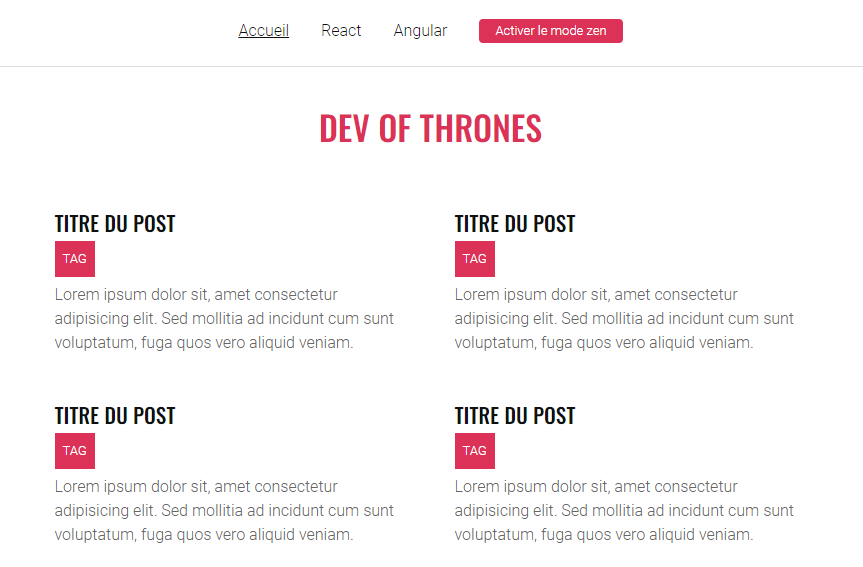
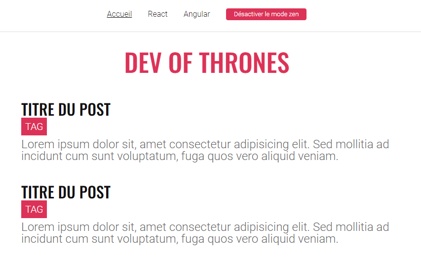

# Blog React (Router > SinglePost)

Objectif : permettre le clic sur un article (ou un lien dans un Post)
pour afficher une page article (`SinglePost`)

la page aura pour URL : `/post/slug-de-l-article`

1. on crée le lien
2. on ajoute la (ou les) route(s)

Pour l'affichage, je suis libre de récupérer les données de l'article
depuis le tableau de données (`posts`) ou de faire un appel API :
<https://oblog-react.vercel.app/api/posts/angular-une-fausse-bonne-idee>

Bonus : redirection si le slug n'existe pas

Mega-bonus : transformer tout le code effectué avec la « nouvelle syntaxe » de React Router

> <https://reactrouter.com/en/main/start/tutorial>

---

# Blog React

L'objectif est de finaliser la construction d'un blog avec React :tada:

Commence par récupérer le React-modele et lance ton serveur de développement pour voir l'avancée du projet.

## 1. Analyse

Le travail a été amorcé. Les composants sont créés et les styles en place.

Avant d'aller plus loin, prends le temps d'analyser tout ça pour voir le rôle de chaque composant. D'ailleurs certains ne sont pas encore utilisés, ça viendra ;)

## 2. Props

Pour l'instant ce blog ne raconte pas grand chose d'intéressant.

Si tu regardes le composant racine, tu verras qu'il récupère des données correspondant aux catégories et aux articles de notre blog.

Tu dois diffuser ces données à travers ton application via les props.

Il faut utiliser les bonnes données pour avoir les bons intitulés des catégories dans le menu en haut de la page et également compléter le contenu des articles.

## 3. State

Il est temps à présent d'ajouter une première fonctionnalité !

Tu vois ce gros bouton `Activer le mode zen` ?

Pour le moment il ne fait rien. Il faut qu'au clic, l'affichage change. On veut voir les articles en plus gros et sur une seule colonne.
Si on re-clique, on repasse en affichage sur 2 colonnes et ainsi de suite.

Voilà ce que ça doit donner :

  
Mode zen : Off

  
Mode zen : On

## 4. API

Il est temps de remplacer nos fausses données (`categoriesData` et `postsData`) par les vraies !!!

Pour ça, on va utiliser notre API maison ; les articles sont là :  
[`https://oblog-react.vercel.app/api/posts`](https://oblog-react.vercel.app/api/posts).

### Instructions

Au premier rendu de l'application :

- déclenche un état de `loading` sur le blog  
  → si loading est à `true` affiche le composant `<Spinner />` !

- envoie une requête `GET` vers l'API (`fetch` ou `axios`)

- stocke le retour dans le _state_ et change le statut `loading`

### Axios

Pour rappel, Axios est une librairie qui permet de récupérer des ressources
externes.

N'oublie pas de l'installer et de lire la
[documentation](https://github.com/axios/axios#example) si nécessaire.

### Bonus

Tu peux également charger les catégories du menu depuis l'API :  
[`https://oblog-react.vercel.app/api/categories`](https://oblog-react.vercel.app/api/categories).
